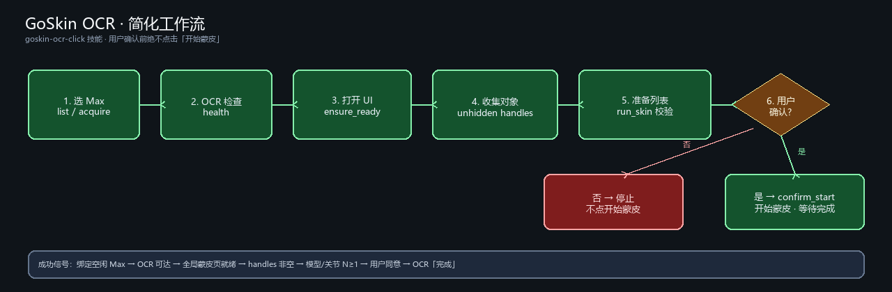
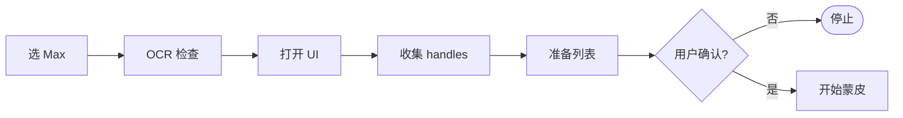

# GoSkin OCR 技能工作报告

**技能（远程为准）：** `skills/3dsmax-mcp-remote`  
**Agent 操作规范：** `skills/3dsmax-mcp-remote/references/goskin-ocr-click.md`（构建后与 skill 包内同名文档）  
**索引：** `skills/3dsmax-mcp-remote/SKILL.md`  
**日期：** 2026-09-16  
**范围：** Agent 主机 **A** 经 HTTP MCP 驱动服务器 **B** / Max **C**，完成自动蒙皮 / GoSkinning Qt 对话框的 OCR 模拟点击（可校验、人工门禁）

---

## 1. 背景与目标

自动蒙皮插件（`自动蒙皮4.*` / 天晴数码）为 Qt UI，**没有可靠子 HWND**，无法用常规 Win32 控件遍历点击。远程 Agent 不安装 `maxmcp`、不改 `max_instances.ini`、不跑仓库 `dialog_monitor/_probe_*.py`，只通过：

**MCP 工具（或 skill 内 stdlib HTTP 脚本）→ B → C：截图 → 外部 OCR → 屏幕坐标模拟点击**

| 目标 | 说明 |
|------|------|
| A/B/C 分离 | A 只谈 MCP；OCR / workspace / 实例表由 B 运维配置 |
| 可重复 | 固定工具顺序；禁止在 A 上发明临时点击脚本 |
| 可校验 | 不信任点击 `ok:true`，用 OCR 计数与摘要确认 |
| 可中断 | 默认不点「开始蒙皮」，必须用户确认 |
| 可多机 | 先 `list_instances`；空闲 ≥2 必须用户选；全程串行 |

---

## 2. 部署拓扑（与 remote SKILL 一致）

| 主机 | 角色 | 安装 / 职责 |
|------|------|-------------|
| **A** | Agent | **`3dsmax-mcp-remote`** + IDE MCP 客户端 → **B** |
| **B** | 3dsmax-mcp 服务 | 完整产品（工具 + `dialog_monitor` 实现） |
| **C** | 3ds Max | Max + bridge；TCP 对 B 可达 |

- 驱动 Max **只**走 B（MCP 工具或 skill `scripts/`）。A 上 **禁止** `import maxmcp`。
- **不要**猜测 `http://127.0.0.1:8000/mcp`；CLI 脚本的 `MAXMCP_URL` / `--url` 必须等于 IDE 已配置的 MCP URL。
- 维护者 / 全仓库说明见 **`3dsmax-mcp-dev`**（含 ini、点击原理、本机冒烟）；**远程 Agent 以 remote 包为准**。

---

## 3. 本期交付摘要（远程视角）

1. **远程技能包**  
   - `SKILL.md` 索引：实例 / 视口 / 上传 / 场景文件 / GoSkin  
   - `references/goskin-ocr-click.md`：硬性规则、选 Max、工作流、失败模式（A 侧）  
   - `scripts/goskin_dev_flow.py`：一键准备（默认不点「开始蒙皮」）  

2. **Agent 调用面**  
   - 优先 IDE MCP：`list_instances` → `acquire_instance` → `goskin_*`  
   - 可选脚本：`goskin_dev_flow.py --instance <name>`（须正确 `MAXMCP_URL`）  
   - `select_max_instance(name=...)` 可作为笨 Agent 的租约入口（不重置场景）  

3. **运行约束写清**  
   - 空闲 ≥2 必须用户选实例；禁止无 `name` 自动抢台  
   - Max 单线程：探活与业务调用全程串行  
   - OCR / workspace 异常时 A **不改** ini，交 B 运维  

---

## 4. 简化工作流



| 步骤 | 动作 | 成功信号 |
|------|------|----------|
| 1 | `list_instances` →（必要时用户选）→ `acquire_instance(name=...)` | 绑定一台空闲在线 Max |
| 2 | `check_dialog_ocr_health` | OCR 可达（A 只探测，不配 ini） |
| 3 | `goskin_ensure_ready` | 全局蒙皮页可见 |
| 4 | `get_unhidden_meshes_bones` | handles 非空（或已知名） |
| 5 | `goskin_run_skin(..., click_start=false)` | 模型/关节 N≥1，`awaiting_start_confirm` |
| 6 | 向用户展示 `user_prompt` | 用户明确同意 |
| 7 | `goskin_confirm_start(user_confirmed=true)` | OCR「完成」后点「操作成功」→「确定」（默认等 300s） |

**一键脚本（可选）：**

```bash
set MAXMCP_URL=<与 mcp.json 中 3dsmax-mcp 相同的 URL>
python scripts/goskin_dev_flow.py --instance <name>
# 用户确认后：
python scripts/goskin_dev_flow.py --instance <name> --confirm-start
```

**完整流程图：** [`images/goskin-ocr-flow.png`](../images/goskin-ocr-flow.png)  
**简化 Mermaid：** [`images/goskin-ocr-flow-simple.mmd`](../images/goskin-ocr-flow-simple.mmd)



---

## 5. 硬性规则（摘要，与 remote goskin 文档一致）

1. **先选 Max**，再 OCR / 场景操作；多空闲必须用户选。  
2. 优先 `goskin_*`，少用原始 `click_plugin_dialog_button`。  
3. **用户确认前绝不点「开始蒙皮」。**  
4. **先聚焦「(选中后在编辑区添加)」再点「选定」。**  
5. 用 OCR / 计数校验，不单信点击成功。  
6. 场景选择为空禁止「选定」。  
7. Max 所在桌面须 **未锁定**（锁屏会出现空成功点击）。

服务端内部固定顺序（A 勿自行重写）：dismiss 警告 → cleanup → 槽位 → 选定模型 → 选定关节 → **停止等确认**。

---

## 6. 模块与依赖（远程为准）

| 层级 | 路径 / 工具 | 说明 |
|------|-------------|------|
| 远程技能索引 | `skills/3dsmax-mcp-remote/SKILL.md` | A 安装此包 |
| GoSkin 规范 | `skills/3dsmax-mcp-remote/references/goskin-ocr-click.md` | Agent 执行对照 |
| 租约 | `instance-locks.md`（skill 模块） | acquire / release |
| HTTP 辅助 | `skills/3dsmax-mcp-remote/scripts/` | stdlib only；`goskin_dev_flow.py` 等 |
| MCP 工具（在 B） | `goskin_*`、`check_dialog_ocr_health`、`list_instances`、`acquire_instance` | A 只调用 |
| 实现（仅 B，A 不碰） | `dialog_monitor/`、`maxscript/mcp/mcp_dialog_monitor.ms` | 运维 / 维护者 |
| B 配置 | `max_instances.ini` `[ocr]` / `[workspace]` | **仅 B**；A 用 health / list 探测 |
| 本地维护者文档 | `skills/3dsmax-mcp-dev/goskin-ocr-click.md` | 含点击原理与本机 `_test_goskin_*` |

---

## 7. 失败模式（A 侧处理）

| 现象 | 处理 |
|------|------|
| 点击 ok 但 OCR 无变化 | 请用户解锁 Max 桌面后重跑 |
| 警告弹窗 / UI 卡住 | 先 dismiss「确定」，再聚焦槽位后选定 |
| `mesh_not_added` | 确认选择非空；重跑 ensure/run；仍失败交 B 查坐标映射 |
| OCR 不可达 | `check_dialog_ocr_health`；A **不改** ini，请 B 运维修 OCR/防火墙 |
| 截图无用 | 保持会话可交互；必要时请 B 查 snapshot |
| 选错 / 抢实例 | 多空闲强制用户选择；串行，勿并行探活 |

---

## 8. 验收建议（远程 Agent）

- [ ] A 仅装 `3dsmax-mcp-remote`，MCP URL 与 IDE 配置一致（不猜 localhost）  
- [ ] `list_instances` → 多空闲时 Agent 停下来询问，再 `acquire_instance(name=...)`  
- [ ] MCP 路径：`goskin_run_skin(..., click_start=false)` 得到 `awaiting_start_confirm=true` 且未点「开始蒙皮」  
- [ ] 用户确认后 `goskin_confirm_start(user_confirmed=true)` 能等到 OCR「完成」并关掉成功弹窗「确定」  
- [ ] 可选：`goskin_dev_flow.py --instance <name>` 与上述 MCP 路径等价（同一 `MAXMCP_URL`）  
- [ ] 锁屏场景人工验证：点击不可静默“成功”  
- [ ] A 侧失败时不改 B 的 ini；健康检查失败升级给 B 运维  

（本机维护者仍可用仓库 `dialog_monitor/_test_goskin_prestart.py`；**不属于远程 skill 交付面**。）

---

## 9. 结论

远程 skill 已将 **选实例 → OCR 健康检查 → 准备 → 人工门禁 → 启动** 固化为 A 可执行的 MCP / 脚本路径，且明确 **A 不碰服务端配置与 Max 侧脚本**。汇报与入门用简化流程图；Agent 执行以 `3dsmax-mcp-remote` 的 `goskin-ocr-click.md` + `SKILL.md` 为准。后续重点是远程桌面稳定性与 MCP URL 配置正确性，而不是在 A 上再发明临时点击脚本。
